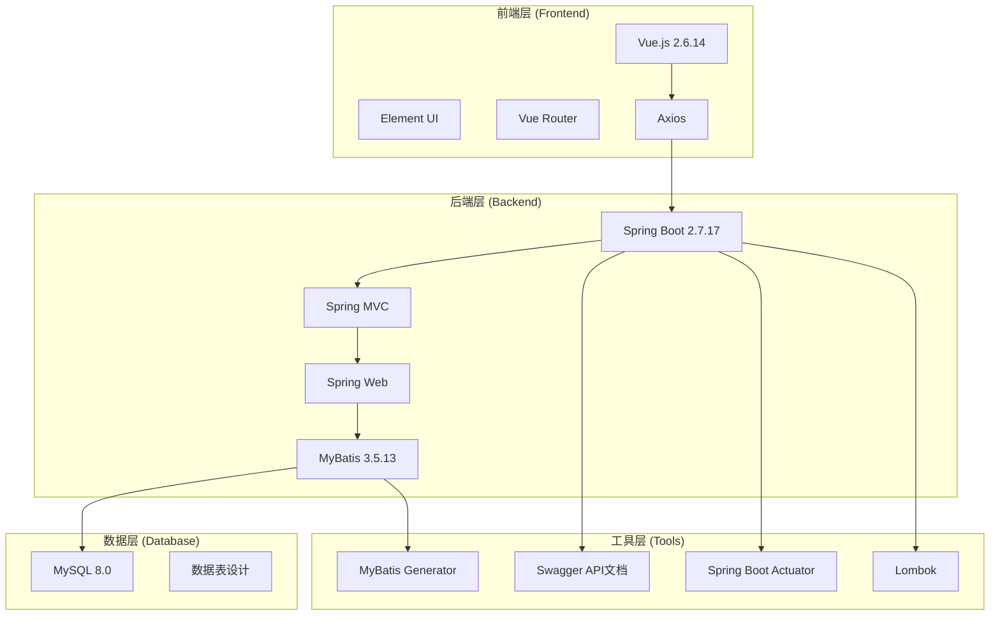
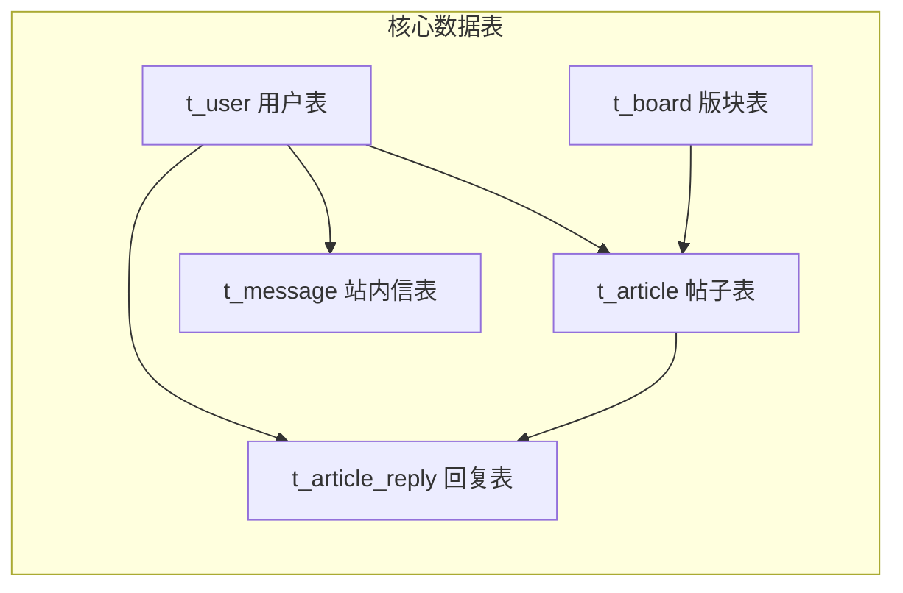

# 论坛系统 (Forum System)


## 📋 项目简介

这是一个基于 **Spring Boot + Vue.js** 开发的现代化论坛系统，采用前后端分离架构设计。系统提供了完整的论坛功能，包括用户管理、版块管理、帖子发布与回复、站内信等核心功能，适合作为企业内部交流平台或技术社区论坛使用。

## ✨ 主要功能

### 👤 用户模块
- **用户注册/登录**：支持用户注册、登录认证
- **个人资料管理**：头像上传、个人信息修改
- **权限管理**：普通用户与管理员权限分级

### 📚 版块管理
- **版块浏览**：支持多个技术版块（Java、C++、前端技术、MySQL等）
- **版块排序**：自定义版块显示优先级
- **版块统计**：实时统计每个版块的帖子数量

### 📝 帖子系统
- **帖子发布**：支持富文本内容发布
- **帖子浏览**：帖子列表展示、详情查看
- **帖子管理**：编辑、删除、状态管理
- **数据统计**：访问量、回复数、点赞数统计

### 💬 回复系统
- **帖子回复**：支持对帖子进行回复
- **楼中楼**：支持对回复进行二级回复
- **回复管理**：回复的删除、状态管理

### 📮 站内信
- **消息发送**：用户间私信功能
- **消息状态**：已读/未读状态管理
- **消息管理**：消息删除、状态更新

### 🛡️ 系统管理
- **用户管理**：用户状态管理、权限分配
- **内容审核**：帖子、回复内容审核
- **系统监控**：基于Spring Boot Actuator的健康检查

## 🏗️ 技术架构

### 系统架构图



### 技术栈详情

#### 后端技术栈
- **框架**：Spring Boot 2.7.17
- **Web层**：Spring MVC
- **持久层**：MyBatis 3.5.13
- **数据库**：MySQL 8.0
- **API文档**：Swagger 3.0.0
- **工具库**：
  - Lombok：简化Java代码
  - Commons Codec：编码解码工具
  - Spring Boot Actuator：监控和管理

#### 前端技术栈
- **框架**：Vue.js 2.6.14
- **UI库**：Element UI 2.15.14
- **路由**：Vue Router 3.5.3
- **HTTP客户端**：Axios 0.21.4
- **构建工具**：Vue CLI 4.5.0

### 数据库设计



## 📁 项目结构

```
forum-master/
├── forum-system-spring/          # 后端项目
│   ├── src/main/java/yc/star/forum/
│   │   ├── controller/           # 控制器层
│   │   │   ├── ArticleController.java      # 帖子控制器
│   │   │   ├── ArticleReplyController.java # 回复控制器
│   │   │   ├── AuthController.java         # 认证控制器
│   │   │   ├── BoardController.java        # 版块控制器
│   │   │   ├── MessageController.java      # 站内信控制器
│   │   │   └── UserController.java         # 用户控制器
│   │   ├── service/              # 服务层
│   │   │   ├── impl/            # 服务实现
│   │   │   └── interface/       # 服务接口
│   │   ├── dao/                 # 数据访问层
│   │   ├── model/               # 实体类
│   │   ├── config/              # 配置类
│   │   ├── common/              # 公共类
│   │   ├── utils/               # 工具类
│   │   ├── exception/           # 异常处理
│   │   └── Interceptor/         # 拦截器
│   ├── src/main/resources/
│   │   ├── mapper/              # MyBatis映射文件
│   │   ├── static/              # 静态资源
│   │   └── application.yml      # 配置文件
│   └── pom.xml                  # Maven配置
├── forum-vue/                   # 前端项目
│   ├── src/
│   │   ├── views/               # 页面组件
│   │   ├── api/                 # API请求
│   │   ├── router/              # 路由配置
│   │   ├── App.vue              # 根组件
│   │   └── main.js              # 入口文件
│   ├── public/                  # 公共资源
│   └── package.json             # 依赖配置
└── forum.sql                    # 数据库脚本
```

## 🚀 快速开始

### 环境要求

- **Java**: JDK 8+
- **Node.js**: 12.0+
- **MySQL**: 8.0+
- **Maven**: 3.6+

### 安装步骤

#### 1. 克隆项目
```bash
git clone <repository-url>
cd forum-master
```

#### 2. 数据库配置
```sql
# 创建数据库
mysql -u root -p
source forum.sql
```

#### 3. 后端启动
```bash
cd forum-system-spring
# 修改 application.yml 中的数据库配置
# 启动后端服务
mvn spring-boot:run
```

#### 4. 前端启动
```bash
cd forum-vue
# 安装依赖
npm install
# 启动开发服务器
npm run serve
```

### 访问地址

- **前端地址**: http://localhost:8080
- **后端API**: http://localhost:8539
- **API文档**: http://localhost:8539/swagger-ui/index.html

## 📊 系统配置

### 数据库配置
```yaml
spring:
  datasource:
    url: jdbc:mysql://127.0.0.1:3306/forum_db?characterEncoding=utf8&useSSL=false
    username: root
    password: 1234
    driver-class-name: com.mysql.cj.jdbc.Driver
```

### 服务器配置
```yaml
server:
  port: 8539
```

### 文件上传配置
```yaml
file:
  upload:
    dir: D:\forum\upload\        # 头像保存目录
    max-size: 5242880           # 文件大小限制(5MB)
    allowed-types: image/jpeg,image/png,image/gif
    access-path: /upload/
```

## 🔧 开发工具

### API文档
项目集成了 Swagger，启动后端服务后访问：
```
http://localhost:8539/swagger-ui/index.html
```

### MyBatis代码生成
```bash
mvn mybatis-generator:generate
```

### 健康检查
```
http://localhost:8539/actuator/health
```

## 🎯 核心功能模块

### 1. 用户认证与授权
- JWT Token认证机制
- 登录拦截器实现
- 用户权限分级管理

### 2. 内容管理系统
- 富文本编辑器支持
- 图片上传功能
- 内容审核机制

### 3. 数据统计分析
- 实时访问量统计
- 用户活跃度分析
- 热门内容排行

### 4. 系统监控
- 应用健康状态监控
- 性能指标收集
- 日志管理系统

## 🔐 安全特性

- **密码加密**：使用MD5+盐值加密存储用户密码
- **SQL注入防护**：MyBatis预编译SQL防止注入攻击
- **XSS防护**：前端输入验证和后端数据过滤
- **CORS配置**：跨域请求安全控制
- **登录验证**：拦截器实现统一登录验证

## 📈 性能优化

- **数据库索引**：关键字段建立索引优化查询性能
- **分页查询**：大数据量分页加载
- **缓存机制**：静态资源缓存配置
- **连接池**：数据库连接池优化

## 🤝 贡献指南

1. Fork 本仓库
2. 创建您的特性分支 (`git checkout -b feature/AmazingFeature`)
3. 提交您的更改 (`git commit -m 'Add some AmazingFeature'`)
4. 推送到分支 (`git push origin feature/AmazingFeature`)
5. 打开一个 Pull Request

## 📝 许可证

本项目采用 MIT 许可证 - 查看 [LICENSE](LICENSE) 文件了解详情。

## 📞 联系方式

- **项目作者**: [YYK]
- **邮箱**: [yyk020906@163.com]
- **GitHub**: [https://github.com/yykgithub-123](https://github.com/yykgithub-123)

## 🙏 致谢

感谢所有为这个项目做出贡献的开发者们！

---

⭐ 如果这个项目对您有帮助，请给它一个星标！